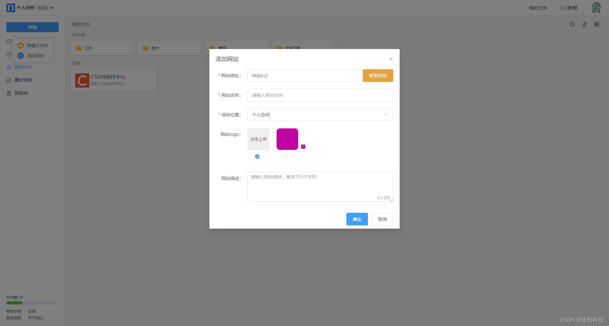

<p align="center"><a href="https://www.navigationline.cn/"></a></p>
<h3 align="center">公司和个人都可以使用的自定义导航工具，替代浏览器书签功能，支持跨浏览器访问</h3>


------------------------------

## 简介

navigationline是一款专业强大的在线导航网站，主要为个人及团队提供自定义资源导航功能，助力提升工作、学习效率。我们致力于成为您每天打开的第一个网站，并成为您访问所有资源的入口。

**适用场景：**

- 个人资源导航，取代浏览器自带的书签功能，方便管理、分享您的资源，方便跨浏览器访问资源。
- 团队资源导航，团队内部可能会有很多资源需要共享，无需每个人都保存一套独有的书签，建立共享资源导航，合理分配人员权限，方便团队成员访问所需资源。
- 建立公共的网站导航页，无需再付费搭建独立导航站，效果可参考：<a href="https://www.navigationline.cn/p/1718183749776097281">AI工具集</a>


## 快速开始

```
# 使用docker-compose来方便的启动应用
# 1.下载工程中的docker-compose.yml、init_mysql.sql文件，在build目录下，下载后放到同一目录
# 2.使用docker-compose命令启动，服务会暴露9523端口
docker-compose up -d
# 3.访问地址：http://yourip:9523
# 4.自行注册使用即可
```

## UI 展示
### 个人空间
新建文件


1. 当前版本支持创建网站和文件夹。

2. 网站须以http或https开头。

3. 提供网站信息抓取功能，支持抓取外网的网站信息。

编辑文件


1. 支持编辑网站信息、支持对文件夹进行重命名。

2. 支持移动或复制网站到其他文件夹。

回收站


1. 我的文件内，选择删除的文件，将进入回收站。
2. 回收站内的文件无法直接查看内容，若误删，选择恢复，即可在我的文件内查看。若选择彻底删除，则无法再找回该文件。支持一键彻底清空回收站内文件。
3. 位于回收站内的文件，系统不会定期自动清理。

我的常用


1. 我的文件内，选择一些常用的网站，添加为我的常用，即可快速访问到所需网站

2. 添加为常用的网站，可以取消常用

最近打开


1. 最近打开菜单，将记录最近访问的网站，按时间倒序排列，方便用户查找资源

团队空间
新建团队


团队可以是一个工作小组，一个班级，一个部门，一个公司等，任何有多人合作的组织，都可以创建一个团队
一个账号下可以创建多个团队，不同团队之间的数据是隔离的
团队创建者（所有者）拥有团队内的最大权限
我的空间


我的空间下创建的资源仅自己能看到
我的空间下不限资源数量
团队空间


团队所有者及团队管理员有权限创建空间
一个团队内可创建多个空间，不同空间内的数据是互相隔离的
每个团队内都有一个公共空间，所有团队成员都有查看、编辑公共空间内数据的权限
除了公共空间，其他空间的权限需要分配给成员
空间权限


空间权限分为：拥有者、可编辑、可查看、禁止访问
拥有者拥有空间的所有权限，包括修改空间信息、管理空间数据等
可编辑权限可以管理空间数据
可查看可以访问空间数据，但无法编辑空间数据
禁止访问表示用户无权访问空间数据
空间设置


可以设置空间的基本信息，包括空间名称、图标、描述等
可以开启安全访问设置，开启后访问空间数据时会生成水印背景
可以删除空间
邀请成员


可以邀请成员加入团队，邀请方式包含链接邀请和通过账号添加
邀请链接可以设置有效的时间，用户点击邀请链接，即可加入团队
团队信息
团队信息


团队信息可以看到团队创建人、创建时间、成员规模等
成员权限


成员权限分为：团队所有者、团队管理员、普通成员
团队所有者拥有团队内的所有权限，包括管理空间、指派团队管理员、邀请成员、解散团队等
团队管理员可以管理空间、邀请成员、修改团队信息等
普通成员可以创建空间，查看其他有权限的空间数据等
发布配置


团队发布后，会生成独立的访问地址，访问该地址，用户可以直观的看到该团队下所有的数据，并集成了搜索引擎
团队发布时，可以选择是否需要登录访问和是否需要权限控制访问
团队设置


可以设置团队的名称及我在该团队的昵称
可以移交或解散团队
个人资料


可以查到个人在团队内的信息
可以设置团队昵称

## 技术栈

-   前端：[Vue.js](https://vuejs.org/)、[Element](https://element.eleme.cn/)
-   后端：[Spring Boot](https://spring.io/projects/spring-boot)
-   数据库：[MySQL](https://www.mysql.com/)
-   基础设施：[Docker](https://www.docker.com/)
